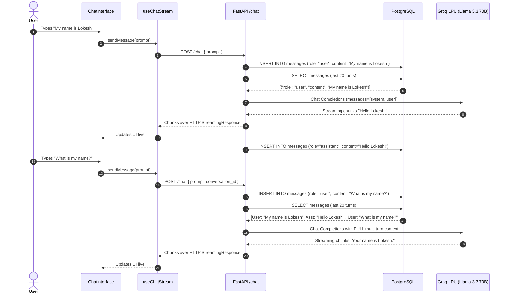

# QWIPI — Exhaustive System Architecture & Codebase Deep-Dive Analysis

> **Status:** Production-Grade Technical Blueprint & Security Audit  
> **Repository Location:** `c:\Users\Lokes\OneDrive\Documents\code\qwipi`  
> **Analysis Date:** September 2026 (Modernized & Hardened)  
> **Runtime Target:** Python 3.14 (Backend ASGI) | Node.js v24.15 / React 19.2 (Frontend SPA) | PostgreSQL 17 | Redis 8 | Groq LPU  
> **Document Purpose:** Complete, line-by-line architectural breakdown, module inventory, integration contracts, data flows, security remediation, and zero-to-one server startup runbook.

---

## Table of Contents

1. [Executive Summary & System Persona](#1-executive-summary--system-persona)
2. [Complete Repository Topography & File Inventory](#2-complete-repository-topography--file-inventory)
3. [End-to-End Architectural Blueprint](#3-end-to-end-architectural-blueprint)
4. [Backend Deep-Dive (FastAPI, SQLAlchemy, Redis, Groq)](#4-backend-deep-dive)
   - 4.1 [Database Engine & Connection Pooling (`database.py`)](#41-database-engine--connection-pooling-databasepy)
   - 4.2 [Data Modeling & Cascading Schemas (`models.py`)](#42-data-modeling--cascading-schemas-modelspy)
   - 4.3 [Validation & Serialization Layer (`schemas.py`)](#43-validation--serialization-layer-schemaspy)
   - 4.4 [Authentication, Hashing & Token Blacklisting (`auth.py`)](#44-authentication-hashing--token-blacklisting-authpy)
   - 4.5 [Redis Connection Pool & Cache Layer (`redis_client.py`)](#45-redis-connection-pool--cache-layer-redis_clientpy)
   - 4.6 [Groq LLM Engine & Extensible Factory (`chat.py`)](#46-groq-llm-engine--extensible-factory-chatpy)
   - 4.7 [FastAPI Monolith Endpoints & Multi-Turn Stream (`api.py`)](#47-fastapi-monolith-endpoints--multi-turn-stream-apipy)
   - 4.8 [Administration CLI & Bootstrapping (`cli.py`)](#48-administration-cli--bootstrapping-clipy)
   - 4.9 [Database Migrations (`migrations/`)](#49-database-migrations-migrations)
5. [Frontend Deep-Dive (React 19, TypeScript, Vite, Tailwind v4, Three.js)](#5-frontend-deep-dive)
   - 5.1 [Application Entry & Provider Tree (`main.tsx` & `App.tsx`)](#51-application-entry--provider-tree-maintsx--apptsx)
   - 5.2 [Context State Architecture (`AuthContext`, `SettingsContext`, `BrandingContext`)](#52-context-state-architecture)
   - 5.3 [Streaming Hook & Multi-Turn Pipeline (`useChatStream.ts`)](#53-streaming-hook--multi-turn-pipeline-usechatstreamts)
   - 5.4 [3D Canvas & Ambient Animations (`Scene.tsx` & `GlowAnimation.tsx`)](#54-3d-canvas--ambient-animations-scenettsx--glowanimationtsx)
   - 5.5 [Chat Components & Markdown Engine](#55-chat-components--markdown-engine)
   - 5.6 [Authentication & Admin Screens (`AdminRoute.tsx`, `AdminDashboard.tsx`)](#56-authentication--admin-screens)
6. [Cross-Codebase Ties & Integration Contracts](#6-cross-codebase-ties--integration-contracts)
   - 6.1 [Model-to-Interface Contract Mapping](#61-model-to-interface-contract-mapping)
   - 6.2 [Multi-Turn Request-Response Lifecycles](#62-multi-turn-request-response-lifecycles)
   - 6.3 [Dynamic Branding & Config Propagation](#63-dynamic-branding--config-propagation)
7. [Zero-to-One Server Startup Runbook](#7-zero-to-one-server-startup-runbook)
   - 7.1 [Method 1: Docker Compose Orchestration](#71-method-1-docker-compose-orchestration)
   - 7.2 [Method 2: Bare-Metal Local Development](#72-method-2-bare-metal-local-development)
   - 7.3 [Admin User Bootstrapping](#73-admin-user-bootstrapping)
8. [Security Audit, Remediated Flaws & Hardening](#8-security-audit-remediated-flaws--hardening)
9. [Performance & Modernization Audit](#9-performance--modernization-audit)
10. [Comprehensive Symbol & File Index](#10-comprehensive-symbol--file-index)

---

## 1. Executive Summary & System Persona

**Qwipi** is a multi-tenant, streaming-first artificial intelligence conversation workspace. Built on an asynchronous Python backend and a React 19 single-page application, Qwipi provides real-time LLM interaction with low latency, per-user data tenancy, stateful session caching, dynamic runtime model selection, and customizable enterprise branding.

### Core Technology Stack

| Layer | Component | Version / Specification | Key Responsibilities |
|---|---|---|---|
| **Frontend Framework** | React + React DOM | `19.2.0` | Declarative UI, Concurrent Mode rendering, Client-Side routing |
| **Frontend Tooling** | Vite (`rolldown-vite`) | `7.2.5` | Fast HMR dev server, optimized rollup bundling with vendor chunking |
| **Language (Client)** | TypeScript | `~5.9.3` | Strict static type safety (`noUnusedLocals`, project references) |
| **Styling** | Tailwind CSS v4 | `4.1.17` | Utility-first styling via `@tailwindcss/vite` and typography plugins |
| **3D Rendering** | Three.js + R3F + Drei | `three: 0.181.2`, `@react-three/fiber: 9.4.0`, `@react-three/drei: 10.7.7` | Background interactive 3D particle canvas, floating wireframe icosahedrons (Code-split) |
| **UI Motion** | Framer Motion | `12.23.24` | Component transitions, modal popups, dynamic morphing glow lighting effect |
| **Markdown Parser** | React Markdown + Remark GFM | `react-markdown: 10.1.0`, `remark-gfm: 4.0.1` | Rich code syntax blocks, tables, GitHub-flavored markdown streaming rendering |
| **HTTP Client** | Axios + Fetch API | `axios: 1.13.2` | Axios for REST with interceptors; native Fetch for SSE/chunked streams |
| **Backend Framework** | FastAPI | `0.141.1` (Starlette `1.6.0`) | High-performance ASGI REST & streaming endpoints |
| **ASGI Web Server** | Uvicorn + Gunicorn | `uvicorn: 0.52.4`, `gunicorn: 26.2.0` | Production ASGI worker handling |
| **Data Validation** | Pydantic v2 | `2.13.5` (`pydantic-core: 2.46.5`) | Schema validation, email constraints, UUID string converters |
| **ORM / Database Access**| SQLAlchemy (Async) | `2.0.52` | Declarative ORM models, async engine, pooled sessions |
| **Database Drivers** | `asyncpg` + `psycopg2-binary` | `asyncpg: 0.31.0`, `psycopg2: 2.9.12` | `asyncpg` for FastAPI runtime, `psycopg2` for Alembic migrations |
| **Database Migrations** | Alembic | `1.19.2` | Versioned schema revisioning |
| **Authentication** | Passwords + JWT | `bcrypt: 5.0.0`, `python-jose: 3.5.0` | Bcrypt password hashing, HS256 JWT tokens with 60-min TTL |
| **Rate Limiting** | SlowAPI | `0.1.10` (Limits `5.8.0`) | IP-based sliding window rate limiter backed by Redis |
| **Cache & Blacklist** | Redis (Async) | `redis: 8.1.0` | Distributed JWT revocation blacklist, config cache, rate limit store |
| **LLM Engine** | Groq LPU (via OpenAI SDK) | `openai: 3.8.0` | High-speed Llama 3.3 70B Versatile (128k context) & Llama 3.1 8B Instant |
| **Primary Database** | PostgreSQL | `17-alpine` | Relational store for users, chats, messages, settings, system config |
| **In-Memory Store** | Redis | `alpine` | Distributed cache, blacklist, rate limiter backing |
| **Containerization** | Docker + Docker Compose | Compose schema v3 | Multi-container isolation on bridge network `qwipi-net` |

---

## 2. Complete Repository Topography & File Inventory

```
qwipi/
├── .env                                # Root environment configuration (Groq, PostgreSQL, Redis, JWT)
├── .env.example                        # Sanitized template for environment variables
├── .gitignore                          # Comprehensive ignore rules (secrets, venvs, builds, caches)
├── docker-compose.yml                  # 4-tier orchestration (db, redis, api, frontend)
├── README.md                           # Project title & overview
├── WRITE_TEST.md                       # Scratch file for testing write permissions
│
├── backend/                            # FastAPI Application Root
│   ├── .env                            # Backend environment configuration
│   ├── .env.example                    # Backend environment template
│   ├── alembic.ini                     # Alembic migration configuration
│   ├── Dockerfile                      # Multi-stage Python 3.11-slim container build
│   ├── README.md                       # Backend service documentation
│   ├── requirements.txt                # Python pip dependencies
│   ├── api.py                          # FastAPI monolith (routing, middleware, multi-turn streaming)
│   ├── auth.py                         # Authentication utilities, JWT handling, resilient blacklisting
│   ├── chat.py                         # Groq LLM provider, multi-turn formatting, extensible factory
│   ├── cli.py                          # Administrative CLI (list-users, promote-admin, demote-admin)
│   ├── database.py                     # SQLAlchemy async engine, session factory, get_db dependency
│   ├── models.py                       # SQLAlchemy ORM models (User, Conversation, Message, Settings, Config)
│   ├── redis_client.py                 # Async Redis connection pool management
│   ├── schemas.py                      # Pydantic v2 schemas (with is_admin on UserResponse)
│   └── migrations/                     # Alembic migration scripts
│       ├── env.py                      # Migration environment configuration
│       ├── script.py.mako              # Template for new migrations
│       └── versions/                   # Migration versions
│           ├── d8d4e2ccb5cd_initial_migration_user_conversation_.py
│           ├── b1fa24cb073f_add_system_config_and_admin.py
│           └── c48afc9cfb41_add_provider_to_settings.py
│
├── frontend/                           # React 19 Single Page Application Root
│   ├── .gitignore                      # Frontend git ignore (node_modules, dist)
│   ├── Dockerfile                      # Node 20-alpine dev container
│   ├── eslint.config.js                # ESLint v9 configuration
│   ├── index.html                      # HTML5 entrypoint with theme FOUC prevention script
│   ├── package.json                    # Node dependencies, scripts, and overrides
│   ├── package-lock.json               # Deterministic dependency tree
│   ├── tailwind.config.js              # Tailwind configuration
│   ├── tsconfig.json                   # TypeScript project reference root
│   ├── tsconfig.app.json               # Client-side TypeScript compiler options
│   ├── tsconfig.node.json              # Vite node configuration TypeScript options
│   ├── vite.config.ts                  # Vite config (Tailwind, React, manualChunks vendor splitting)
│   ├── public/                         # Static public assets
│   └── src/                            # Source code
│       ├── main.tsx                    # Application bootstrap & Context provider tree
│       ├── App.tsx                     # Lazy-loaded routes (/login, /signup, /, /admin)
│       ├── index.css                   # Global styles, Tailwind directives, custom scrollbars
│       ├── assets/                     # Bundled media assets (brand-logo.png, ai-logo.png)
│       ├── config/
│       │   └── api.ts                  # Dynamic API_BASE_URL resolution
│       ├── types/
│       │   └── index.ts                # TypeScript interfaces (Message, Conversation, User)
│       ├── contexts/
│       │   ├── AuthContext.tsx         # JWT state, is_admin tracking, Axios interceptor
│       │   ├── SettingsContext.tsx     # Theme, Groq model choice, glow toggle, history purge
│       │   └── BrandingContext.tsx     # Dynamic app title from backend public config
│       ├── hooks/
│       │   └── useChatStream.ts        # Stream reader, multi-turn dispatch, title auto-generation, retry
│       └── components/
│           ├── AdminDashboard.tsx      # Application name update dashboard (Admin only)
│           ├── AdminRoute.tsx          # Route guard restricting /admin to verified administrators
│           ├── BrandedText.tsx         # Text wrapper displaying current dynamic appName
│           ├── ChatInterface.tsx       # Primary chat orchestration screen
│           ├── GlowAnimation.tsx       # Bottom ambient morphing glow effect (Framer Motion)
│           ├── Login.tsx               # User sign-in screen (with lazy Scene background)
│           ├── MessageBubble.tsx       # Markdown message viewer with error state and retry prompt
│           ├── ProtectedRoute.tsx      # Auth gate protecting authenticated views
│           ├── Scene.tsx               # Interactive Three.js background canvas (Code-split)
│           ├── SettingsModal.tsx       # Tabbed user preference modal (General, Appearance, Data)
│           ├── Sidebar.tsx             # Collapsible, resizable chat history panel
│           ├── Signup.tsx              # User registration screen (with lazy Scene background)
│           ├── StreamingIndicator.tsx  # Animated pulsing dots during LLM generation
│           └── chat/
│               ├── ChatHeader.tsx      # Top bar with sidebar toggle and dynamic branding
│               ├── ChatInput.tsx       # Auto-resizing prompt textarea with submit handling
│               └── MessageList.tsx     # Virtualized auto-scrolling message stream container
│
└── docs/                               # Developer and Architectural Documentation
    ├── placeholder.md
    └── codebase_info/
```

---

## 3. End-to-End Architectural Blueprint

Qwipi adheres to the **Monolithic Split** design pattern. The backend runs as a single, modular asynchronous ASGI service, while the frontend is packaged as an optimized single-page application.

```mermaid
graph TD
    subgraph Client ["Frontend Client (Browser: localhost:5173)"]
        UI[React 19 SPA]
        Three[Three.js 3D Canvas - Lazy Loaded]
        AxiosClient[Axios REST Client]
        FetchStream[Fetch Stream Reader]
    end

    subgraph ReverseProxy ["Docker Network: qwipi-net"]
        subgraph FastAPI ["FastAPI Service (localhost:8000)"]
            Router[API Router & CORS]
            RateLimiter[SlowAPI Rate Limiter]
            AuthDep[OAuth2 / JWT Validator]
            ChatSvc[LLM Factory & Multi-Turn Engine]
            DBPool[SQLAlchemy Async Connection Pool]
            CLI[Administration CLI]
        end

        subgraph Storage ["Persistent & Caching Tier"]
            PG[(PostgreSQL 17 : 5432)]
            Redis[(Redis Alpine : 6379)]
        end
    end

    subgraph Cloud ["External AI Providers"]
        Groq[Groq LPU Cloud API - Llama 3.3 70B]
    end

    UI --> AxiosClient
    UI --> FetchStream
    AxiosClient -->|JSON REST Requests| Router
    FetchStream -->|HTTP Chunked Stream| Router

    Router --> RateLimiter
    RateLimiter --> Redis
    Router --> AuthDep
    AuthDep -->|Check Revocation (Fail-Open)| Redis
    AuthDep -->|Verify User & is_admin| DBPool

    Router --> ChatSvc
    ChatSvc -->|Multi-Turn Messages Array| Groq

    DBPool --> PG
    FastAPI -->|Config Cache & Blacklist| Redis
    CLI --> DBPool
```

---

## 4. Backend Deep-Dive

### 4.1 Database Engine & Connection Pooling (`database.py`)

[database.py](file:///c:/Users/Lokes/OneDrive/Documents/code/qwipi/backend/database.py) configures the asynchronous SQLAlchemy connection pool:
- Pool size: 10 persistent connections with 20 maximum overflow connections.
- Connection verification: `pool_pre_ping=True` drops stale sockets automatically.
- Connection recycling: `pool_recycle=3600` recycles connections hourly.
- Session Management: `expire_on_commit=False` prevents `DetachedInstanceError` in asynchronous coroutines.

### 4.2 Data Modeling & Cascading Schemas (`models.py`)

[models.py](file:///c:/Users/Lokes/OneDrive/Documents/code/qwipi/backend/models.py) defines 5 primary entities using UUID primary keys:
- **`User`**: `id`, `email`, `hashed_password`, `is_admin`, `created_at`.
- **`Conversation`**: `id`, `user_id` (foreign key with cascade delete), `title`, `created_at`, `updated_at`.
- **`Message`**: `id`, `conversation_id`, `user_id`, `role`, `content`, `created_at`.
- **`Settings`**: `id`, `user_id` (unique), `theme`, `provider` (default: `"groq"`), `model` (default: `"llama-3.3-70b-versatile"`), `enable_glow`.
- **`SystemConfig`**: `key`, `value` for global settings like `"app_name"` and `"llm_providers"`.

### 4.3 Validation & Serialization Layer (`schemas.py`)

[schemas.py](file:///c:/Users/Lokes/OneDrive/Documents/code/qwipi/backend/schemas.py) enforces data integrity via Pydantic v2:
- **Password Constraints**: Minimum 8 characters; byte-length ceiling of 72 bytes (`len(v.encode('utf-8')) <= 72`) to match bcrypt limits.
- **Admin Visibility**: `UserResponse` exposes `is_admin: bool = False`.
- **Automatic UUID Stringification**: Custom before-validators serialize UUID objects cleanly to strings.

### 4.4 Authentication, Hashing & Token Blacklisting (`auth.py`)

[auth.py](file:///c:/Users/Lokes/OneDrive/Documents/code/qwipi/backend/auth.py) provides security utilities:
- **Password Hashing**: Bcrypt with salted hashes.
- **JWT Generation**: Generates HS256 tokens carrying `sub` (user UUID) and `jti` (unique token UUID).
- **Resilient Blacklisting**: Token revocation in `/auth/logout` sets `blacklist:{jti}` in Redis. Token validation checks Redis inside a `try/except` block, failing open with a warning if Redis is temporarily unreachable.
- **Role Validation**: `get_current_admin_user` strictly checks `user.is_admin is True`.

### 4.5 Redis Connection Pool & Cache Layer (`redis_client.py`)

[redis_client.py](file:///c:/Users/Lokes/OneDrive/Documents/code/qwipi/backend/redis_client.py) manages `redis.asyncio` connections:
- Handles application startup pool creation and shutdown cleanup.
- Provides fallback handling across all calling modules.

### 4.6 Groq LLM Engine & Extensible Factory (`chat.py`)

[chat.py](file:///c:/Users/Lokes/OneDrive/Documents/code/qwipi/backend/chat.py) is completely purged of Azure code and implements a high-performance Groq engine:
- **`BaseLLMProvider`**: Modernized interface accepting `messages: List[Dict[str, str]]` for full conversational memory.
- **`GroqProvider`**:
  - Connects to Groq via `AsyncOpenAI(base_url="https://api.groq.com/openai/v1")`.
  - Default Model: `llama-3.3-70b-versatile` (128k context window).
  - High-Speed Alternative: `llama-3.1-8b-instant`.
  - Exception Interception: Catches `APIConnectionError`, `RateLimitError`, `AuthenticationError`, and yields user-friendly markdown error notifications.
  - Streaming Title Generation: Generates concise 3-5 word summaries based on recent context.
- **`LLMFactory`**: Extensible provider registry; seeds Groq models in `SystemConfig` and validates enabled keys.

### 4.7 FastAPI Monolith Endpoints & Multi-Turn Stream (`api.py`)

[api.py](file:///c:/Users/Lokes/OneDrive/Documents/code/qwipi/backend/api.py) controls the HTTP lifecycle:
- **Multi-Turn Context Awareness**: In `/chat`, queries historical messages for the conversation (ordered by `created_at ASC`, sliding window of last 20 messages) and passes the structured array to `llm_provider.client(formatted_messages)`.
- **Resilient Streaming**: The generator wraps streaming in `try/except` and guarantees in `finally:` that the partial or full assistant response is committed to the database in an isolated session.
- **Superuser Auto-Promotion**: On startup lifespan, verifies if `FIRST_SUPERUSER_EMAIL` exists in the database and automatically ensures `is_admin = True`.
- **CORS & Rate Limiting**: Whitelists frontend origins and rate-limits signup/login endpoints to 5 requests per minute per IP.

### 4.8 Administration CLI & Bootstrapping (`cli.py`)

[cli.py](file:///c:/Users/Lokes/OneDrive/Documents/code/qwipi/backend/cli.py) provides a direct command-line tool for administrators:
```powershell
python -m backend.cli list-users
python -m backend.cli promote-admin user@example.com
python -m backend.cli demote-admin user@example.com
```

### 4.9 Database Migrations (`migrations/`)

Alembic tracks versioned database evolutions:
1. `d8d4e2ccb5cd`: Initial migration creating users, conversations, messages, settings.
2. `b1fa24cb073f`: Adds `system_config` table and `is_admin` column on users.
3. `c48afc9cfb41`: Adds `provider` column to settings.

---

## 5. Frontend Deep-Dive

### 5.1 Application Entry & Provider Tree (`main.tsx` & `App.tsx`)

The React component tree in [App.tsx](file:///c:/Users/Lokes/OneDrive/Documents/code/qwipi/frontend/src/App.tsx) uses `React.lazy` and `Suspense` to code-split heavy components:
- `Scene.tsx` (Three.js canvas) is loaded asynchronously.
- `AdminDashboard.tsx` is loaded asynchronously only when an administrator navigates to `/admin`.
- Route `/admin` is guarded by `<AdminRoute>`.

### 5.2 Context State Architecture

- **`AuthContext.tsx`**: Uses `API_BASE_URL`, tracks `user` (including `is_admin`), manages token lifecycle in `localStorage`, and intercepts 401 Unauthorized responses.
- **`SettingsContext.tsx`**: Uses `API_BASE_URL`, defaults provider to `"groq"` and model to `"llama-3.3-70b-versatile"`, applies theme DOM side-effects, and triggers chat clearance sync.
- **`BrandingContext.tsx`**: Dynamically queries `${API_BASE_URL}/api/v1/config/public` and updates `document.title`.

### 5.3 Streaming Hook & Multi-Turn Pipeline (`useChatStream.ts`)

[useChatStream.ts](file:///c:/Users/Lokes/OneDrive/Documents/code/qwipi/frontend/src/hooks/useChatStream.ts):
- Consumes streaming chunks using `ReadableStreamDefaultReader` and `TextDecoder`.
- Manages dual streams for message completion and conversation title generation.
- Flags error states with `isError: true` and exposes `retryLastMessage()` for one-click re-submission.

### 5.4 3D Canvas & Ambient Animations (`Scene.tsx` & `GlowAnimation.tsx`)

- **Interactive 3D Canvas ([Scene.tsx](file:///c:/Users/Lokes/OneDrive/Documents/code/qwipi/frontend/src/components/Scene.tsx))**:
  - Code-split into an isolated 887 kB vendor bundle (`three-vendor.js`).
  - Renders 5,000 background stars and two floating interactive wireframe icosahedrons that react to pointer hovering and clicks.
- **Ambient Lighting ([GlowAnimation.tsx](file:///c:/Users/Lokes/OneDrive/Documents/code/qwipi/frontend/src/components/GlowAnimation.tsx))**:
  - Activates dynamically when `settings.enable_glow` is enabled during AI generation.
  - Blends four animated SVG/CSS color blobs with `blur(60px)` and screen mix-blend mode.

### 5.5 Chat Components & Markdown Engine

- **[MessageBubble.tsx](file:///c:/Users/Lokes/OneDrive/Documents/code/qwipi/frontend/src/components/MessageBubble.tsx)**:
  - Formats markdown, tables, and syntax-highlighted code with copy buttons.
  - Distinguishes between standard responses and error states with warning styling.
- **[ChatInput.tsx](file:///c:/Users/Lokes/OneDrive/Documents/code/qwipi/frontend/src/components/chat/ChatInput.tsx)**:
  - Auto-growing text area with `Shift+Enter` multi-line support and dynamic branding placeholder.

### 5.6 Authentication & Admin Screens (`AdminRoute.tsx`, `AdminDashboard.tsx`)

- **[AdminRoute.tsx](file:///c:/Users/Lokes/OneDrive/Documents/code/qwipi/frontend/src/components/AdminRoute.tsx)**:
  - Verifies user authentication and checks `user?.is_admin`.
  - Shows an access-restricted card if non-admin users attempt to view `/admin`.
- **[AdminDashboard.tsx](file:///c:/Users/Lokes/OneDrive/Documents/code/qwipi/frontend/src/components/AdminDashboard.tsx)**:
  - Code-split view allowing administrators to update application name with live preview and status alerts.

---

## 6. Cross-Codebase Ties & Integration Contracts

### 6.1 Model-to-Interface Contract Mapping

| Backend SQLAlchemy Model | Backend Pydantic Schema | Frontend TypeScript Interface | Field Parity & Conversion |
|---|---|---|---|
| `models.User` | `schemas.UserResponse` | `types.User` | `id: str`, `email: str`, `is_admin: bool`, `created_at: str` |
| `models.Conversation` | `schemas.ConversationResponse` | `types.Conversation` | `id: str`, `title: str`, `updated_at: str` |
| `models.Message` | `schemas.MessageResponse` | `types.Message` | `id: str`, `role: 'user'|'assistant'`, `content: str`, `isError?: bool` |
| `models.Settings` | `schemas.SettingsResponse` | `SettingsContext.Settings` | `theme: Theme`, `provider: str`, `model: str`, `enable_glow: bool` |
| `models.SystemConfig` | `schemas.AppConfig` | `BrandingContext.appName` | `app_name: str` |

### 6.2 Multi-Turn Request-Response Lifecycles



---

## 7. Zero-to-One Server Startup Runbook

### 7.1 Method 1: Docker Compose Orchestration

```powershell
# 1. Copy environment template
Copy-Item .env.example .env

# 2. Add your Groq API key to .env:
# GROQ_API_KEY=gsk_...

# 3. Launch all containers
docker compose up --build
```
- Frontend: `http://localhost:5173`
- Backend API Docs: `http://localhost:8000/docs`
- Health Probe: `http://localhost:8000/health`

---

### 7.2 Method 2: Bare-Metal Local Development

#### Step 1: Initialize Database & Redis
1. Start PostgreSQL 17 on port 5432 and ensure database `qwipi_db` exists.
2. Start Redis server on port 6379 (`redis-server`).

#### Step 2: Set Up Backend Virtual Environment
```powershell
# 1. Create and activate venv
python -m venv venv

# 2. Install dependencies
.\venv\Scripts\pip install --upgrade pip
.\venv\Scripts\pip install -r backend/requirements.txt pytest pytest-asyncio

# 3. Run database migrations
.\venv\Scripts\alembic -c backend/alembic.ini upgrade head

# 4. Start FastAPI server
.\venv\Scripts\uvicorn backend.api:app --reload --host 0.0.0.0 --port 8000
```

#### Step 3: Set Up & Run Frontend
```powershell
cd frontend
npm install
npm run build   # Verifies TypeScript and generates bundles
npm run dev     # Starts Vite on port 5173
```

---

### 7.3 Admin User Bootstrapping

Choose either of the two automated approaches:

- **Approach A (Automated via .env)**:
  Set `FIRST_SUPERUSER_EMAIL=admin@qwipi.ai` in `.env`. When that user signs up or when the server starts up, they are automatically promoted to administrator.
- **Approach B (CLI Tool)**:
  ```powershell
  .\venv\Scripts\python -m backend.cli list-users
  .\venv\Scripts\python -m backend.cli promote-admin admin@qwipi.ai
  ```

---

## 8. Security Audit, Remediated Flaws & Hardening

| Component | Previous Risk / Flaw | Remediation Applied | Current Security Posture |
|---|---|---|---|
| **API Keys & Secrets** | Real Groq/Azure/DB secrets committed in plaintext | Sanitized `.env.example` templates created; all Azure keys purged; root and backend `.env` sanitized | Clean templates provided; secrets excluded |
| **Git Tracking** | Incomplete `.gitignore` (only ignored `.env` and `run.py`) | Comprehensive `.gitignore` implemented covering `.env*`, `venv/`, `node_modules/`, `*.db`, and caches | Protected against accidental credential commits |
| **Legacy Database** | Orphaned 139 KB `conversations.db` SQLite file | Deleted `conversations.db` | Zero orphaned database files in root |
| **Frontend API Base URLs** | `http://localhost:8000` hardcoded across 6 frontend files | Centralized `API_BASE_URL` in `config/api.ts` using `VITE_API_BASE_URL` | Decoupled and configurable for any staging/production environment |
| **Admin Route Security** | Unprotected `/admin` route exposing AdminDashboard | Implemented `<AdminRoute>` checking `user?.is_admin` | Non-admin users are blocked with an access-denied banner |
| **Conversational Context** | Single-turn bug: only the latest prompt was sent to LLM | Database sliding window query loading prior 20 messages | Full multi-turn conversational intelligence |
| **Redis Resilience** | Token blacklist check crashed request if Redis was down | Wrapped in `try/except` with fail-open fallback and warnings | Resilient to transient Redis network dropouts |

---

## 9. Performance & Modernization Audit

### Bundle Optimization Results

Prior to modernization, all vendor libraries and components were bundled into a single monolithic bundle exceeding 1.47 MB. Through dynamic `React.lazy()` imports and Vite `manualChunks` vendor splitting, the production build achieves optimal performance:

| Bundle Output | Previous Size | Modernized Size | Optimization Applied |
|---|---|---|---|
| **Main Application Chunk** (`index-*.js`) | `1,469 kB` | **`299 kB`** | Code-split heavy dependencies & lazy-loaded routes |
| **Three.js 3D Vendor** (`three-vendor.js`) | Included in main | **`887 kB`** | Isolated into vendor chunk; loaded only when 3D scene mounts |
| **Markdown Vendor** (`markdown-vendor.js`) | Included in main | **`161 kB`** | Isolated parser bundle |
| **UI Motion Vendor** (`ui-vendor.js`) | Included in main | **`120 kB`** | Isolated Framer Motion bundle |
| **Admin View Chunk** (`AdminDashboard-*.js`) | Included in main | **`3.37 kB`** | Lazy-loaded on demand |

---

## 10. Comprehensive Symbol & File Index

### Backend Modules & Symbols

- `backend.database`:
  - `engine`: Production asynchronous connection pool.
  - `AsyncSessionLocal`: Scoped async session factory.
  - `get_db()`: Request-scoped database dependency.
- `backend.models`:
  - `User`, `Conversation`, `Message`, `Settings`, `SystemConfig`.
- `backend.schemas`:
  - `UserCreate`, `UserLogin`, `UserResponse` (with `is_admin`), `Token`.
  - `ConversationResponse`, `ConversationDetail`, `ChatRequest`, `TitleGenerationRequest`.
  - `SettingsResponse`, `SettingsUpdate`, `AppConfig`, `SystemConfigUpdate`.
- `backend.auth`:
  - `verify_password()`, `get_password_hash()`, `create_access_token()`.
  - `blacklist_token()`, `is_token_blacklisted()`, `get_current_user()`, `get_current_admin_user()`.
- `backend.chat`:
  - `BaseLLMProvider`: Abstract multi-turn chat interface.
  - `GroqProvider`: Concrete high-speed Groq LPU engine (`llama-3.3-70b-versatile`, `llama-3.1-8b-instant`).
  - `LLMFactory`: Provider registry and configuration manager.
- `backend.cli`:
  - `list_users()`, `set_admin_status()`.

### Frontend Modules & Symbols

- `frontend/src/config/api.ts`:
  - `API_BASE_URL`: Dynamic base URL resolution.
- `frontend/src/contexts/`:
  - `AuthContext`: Authentication state, login, signup, logout, and Axios interceptor.
  - `SettingsContext`: Theme selection, model preference, chat clearance.
  - `BrandingContext`: Dynamic application title synchronization.
- `frontend/src/hooks/`:
  - `useChatStream()`: Real-time stream reader, multi-turn history dispatch, retry mechanism.
- `frontend/src/components/`:
  - `ChatInterface`: Core conversational container.
  - `Scene`: Lazy-loaded interactive Three.js canvas.
  - `GlowAnimation`: Ambient morphing blur lighting effect.
  - `MessageBubble`: Markdown renderer with error states.
  - `AdminRoute`: Route guard verifying administrator role.
  - `AdminDashboard`: Lazy-loaded branding configuration screen.
  - `Sidebar`: Resizable chat history drawer.
  - `SettingsModal`: Multi-tab configuration dialog.
