# Skill: Chat System

> [!IMPORTANT]
> **Core Feature**: Changes here directly affect the primary user loop (messaging).

## 1. Definition
The **Chat System** manages the bidirectional flow of messages between the user and the Azure OpenAI LLM, including persistent storage and side-effects like title generation.

## 2. Prerequisites (Context)
For this skill to function, the following must be active:
*   **Backend**: `uvicorn backend.api:app` running on port 8000.
*   **Database**: `conversations.db` initialized with `Conversation` and `Message` tables.
*   **LLM**: Valid Azure OpenAI credentials in `.env`.
*   **Settings Sync**: `SettingsProvider` must wrap the components to handle real-time state resets.

## 3. Coupling Map (Logic Ties)
| dependency | reason | risk |
| :--- | :--- | :--- |
| `frontend/src/components/ChatInterface.tsx` | Main UI Controller | 🔴 **High**: Hardcoded to `http://localhost:8000`. Listens for `lastClearedAt`. |
| `backend/api.py` | Backend Handler | 🔴 **High**: Defines the streaming response shape and settings mutation. |
| `backend/chat.py` | Intelligence | 🟠 **Medium**: Text streaming logic matches UI decoders. |
| `frontend/src/components/Sidebar.tsx` | Navigation | 🟡 **Low**: Consumes `conversations` list update triggers. |
| `frontend/src/contexts/SettingsContext.tsx` | Configuration & Sync | 🟠 **Medium**: Manages global settings and data clearing timestamps. |

## 4. Blast Radius (Side-Effect Warnings)

> [!WARNING]
> **Deployment Fragility**
> The frontend (`ChatInterface.tsx`) forces a connection to `http://localhost:8000`.
> *   **Effect**: The app will fail in any environment where the backend is not exactly at this address (e.g., Docker, Production).
> *   **Constraint**: Do not change the backend port without a refactor of the frontend `fetch` calls.

> [!CAUTION]
> **Streaming Protocol**
> The backend streams raw text chunks without a JSON envelope.
> *   **Effect**: `ChatInterface.tsx` uses a `TextDecoder` to read this raw stream.
> *   **Constraint**: Do not wrap chunks in JSON (e.g., `data: { "text": "..." }`) without rewriting the frontend decoder logic.

## 5. Pre-Flight Verification
**Agent Protocol**: Run this check before editing `ChatInterface.tsx` or `api.py`.
1.  **Check API URL**: Are you changing the backend host? If yes, `ChatInterface.tsx` MUST be updated.
2.  **Check Stream Format**: Are you changing how `generate()` yields data? If yes, verify `MessageBubble.tsx` rendering and `ChatInterface` decoding.

---

## 🚦 Technical Reference

### Data Flow: Sending a Message

```mermaid
sequenceDiagram
    participant User
    participant UI as ChatInterface
    participant API as FastAPI
    participant DB as SQLite
    participant LLM as Azure OpenAI

    User->>UI: Types message & hits Enter
    UI->>UI: Optimistic update (Show User Msg)
    UI->>API: POST /chat (prompt, conversation_id?)
    
    rect rgb(20, 20, 20)
        Note over API: Backend Processing
        API->>DB: Get or Create Conversation
        API->>DB: Save User Message
        API->>LLM: Stream Chat Completion
    end

    API-->>UI: Stream Response (Chunks)
    UI-->>UI: Update Assistant Msg (Real-time)

    rect rgb(40, 40, 40)
        Note over API: Post-Response
        API->>DB: Save Assistant Message
    end
```

