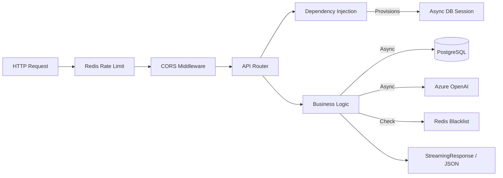

# Skill: Backend Flow

> [!NOTE]
> **Infrastructure Skill**: Defines how the FastAPI server processes requests and manages resources.

## 1. Definition
This skill encompasses the **Request Lifecycle**, **Dependency Injection**, and **Async Database Management** used by the backend.

## 2. Prerequisites (Context)
*   **Environment**: `.env` file must be loaded (`load_dotenv` in `chat.py`).
*   **Database**: `conversations.db` must be writeable by the process.

## 3. Coupling Map (Logic Ties)
| dependency | reason | risk |
| :--- | :--- | :--- |
| `api.py` | Implementation | 🔴 **High**: Core logic hub. |
| `database.py` | Session Factory | 🔴 **High**: Controls all DB connections. |
| `models.py` | ORM | 🟠 **Medium**: Schema definitions. |

## 4. Blast Radius (Side-Effect Warnings)

> [!WARNING]
> **Async Session Lifecycle**
> The `get_db` dependency yields an `AsyncSession` that closes specifically when the *request* finishes.
> *   **Effect**: Using this session inside a `BackgroundTasks` function or after a `StreamingResponse` has yielded might fail if the session is closed prematurely.
> *   **Constraint**: For background work (like title generation), you MUST instantiate a new `AsyncSessionLocal()`, do not reuse the dependency.

> [!IMPORTANT]
> **Streaming Concurrency**
> `StreamingResponse` keeps the main thread connection open.
> *   **Constraint**: Ensure any heavy computation inside the stream generator uses `await` to yield control back to the event loop, or you will block the entire server.

## 5. Pre-Flight Verification
**Agent Protocol**: Run this check before modifying `api.py`.
1.  **Check Background Tasks**: Are you moving logic to the background? If yes, verify you are creating a NEW db session.
2.  **Check Response Type**: Are you changing from JSON to Stream? If yes, check frontend decoder compatibility.

---

## 🏗️ Request Architecture

## ⚙️ Environment Variable Manifest
| Variable | Purpose | Required |
| :--- | :--- | :--- |
| `DATABASE_URL` | PostgreSQL connection string | Yes |
| `REDIS_URL` | Redis connection string | Yes |
| `SECRET_KEY` | JWT signing secret | Yes |
| `ALGORITHM` | JWT hashing algorithm (HS256) | No |
| `AZURE_OPENAI_API_KEY` | LLM Access Key | Yes |
| `AZURE_OPENAI_ENDPOINT` | LLM Gateway URL | Yes |
| `AZURE_OPENAI_DEPLOYMENT`| Model Deployment Name | Yes |
| `AZURE_OPENAI_VERSION` | API Version (e.g., 2024-02-15-preview) | Yes |
| `ALLOWED_ORIGINS` | CORS whitelist | No |
| `DEBUG` | Enable SQLAlchemy echo | No |
