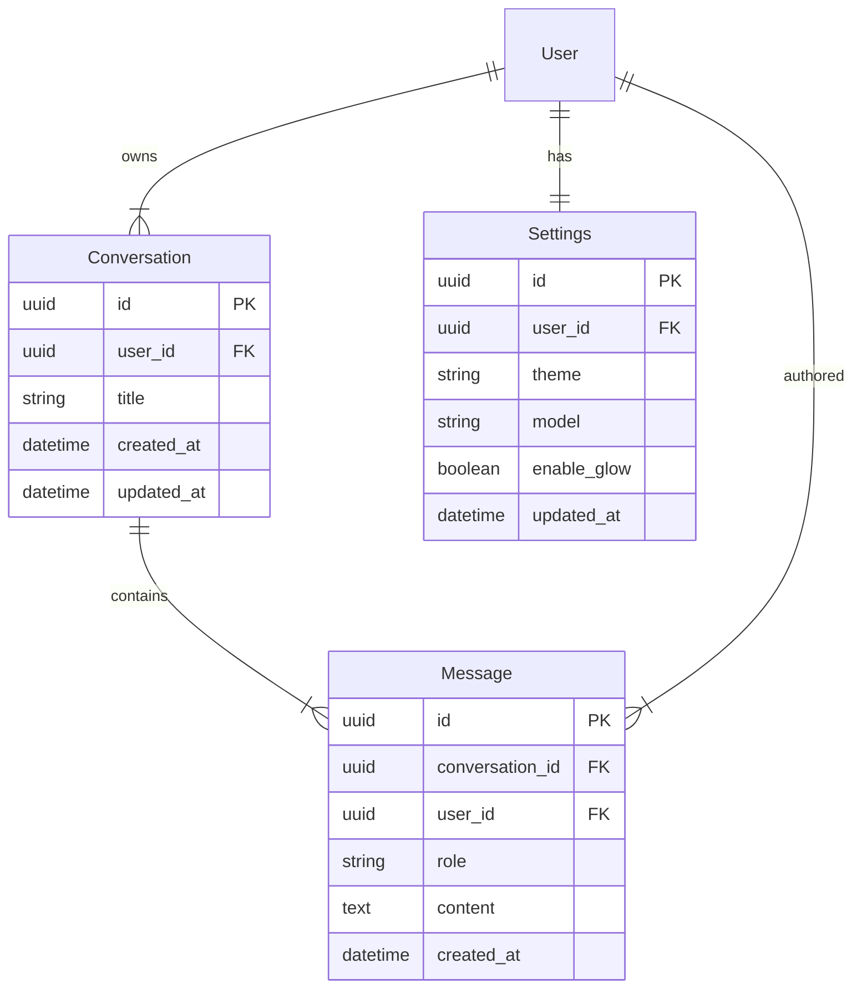

# Database Schema

**Type**: PostgreSQL (via SQLAlchemy/AsyncPG)
**Location**: Managed via `db` service in `docker-compose.yml`

## 🕸️ Entity Relationship Diagram

## 📝 Models

### Conversation
- **Source**: [models.py:7](file:///home/lokesh/code/qwipi/backend/models.py#L7)
- **Primary Key**: `id` (UUID string)
- **Cascade**: Deleting a Conversation deletes all its Messages (`cascade="all, delete-orphan"`).

### Message
- **Source**: [models.py:17](file:///home/lokesh/code/qwipi/backend/models.py#L17)
- **Foreign Key**: `conversation_id` -> `conversations.id`

### Settings
- **Source**: [models.py:53](file:///home/lokesh/code/qwipi/backend/models.py#L53)
- **Constraint**: Scoped per-user (unique `user_id`).
- **Default**: `enable_glow` defaults to `True`.

## ⚠️ Integrity Constraints
- **Orphan Prevention**: Messages cannot exist without a parent Conversation.
- **Timestamps**: All timestamps are UTC (`datetime.utcnow`).
