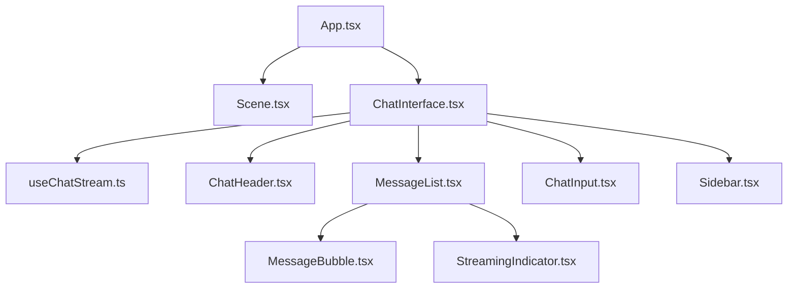

# Frontend Architecture

**Stack**: React 19, Vite, TailwindCSS 4, Framer Motion.

## 🧱 Component Tree

## 🧠 State Management

### Modular State
The application has been refactored to separate business logic from presentation.
- **`useChatStream.ts`** (Custom Hook):
    - Manages `messages`, `conversations`, and `isLoading`.
    - Handles all API interactions (streaming, fetching, deleting).
    - Encapsulates the "Optimistic UI" and "Typewriter" title effects.
- **`ChatInterface.tsx`** (View Orchestrator):
    - Coordinates the sub-components and sidebar state.
- **`SettingsContext.tsx`** (Global Context):
    - Manages user preferences (`theme`, `enable_glow`).
    - Triggers state resets via `lastClearedAt`.

### ⚡ Side Effects & Sync
1. **Sending Message**: Appends to UI immediately for speed.
2. **Real-time Reset**: `ChatInterface` watches `lastClearedAt` from the context. When this value updates, the component wipes its local `conversations` and `messages` state, ensuring parity with the backend without a refresh.

## 🎨 Styling Architecture
- **Tailwind**: Used for layout and typography.
- **App.css**: Custom scrollbar hiding utilities.
- **Glassmorphism**: Heavy use of `backdrop-blur`, `bg-white/10`, and `border-white/10` to achieve the transparent aesthetic.
